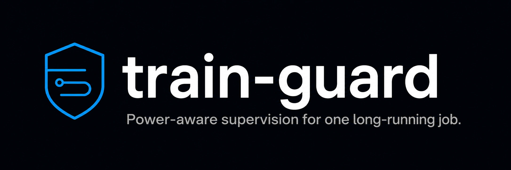

[](https://github.com/fus3r/train-guard/actions/workflows/ci.yml)

`train-guard` is a local process supervisor for long-running compute jobs. It
observes the laptop's power source, charge level and available battery
temperature, then applies one of three actions to the job's process tree:
`full`, `gentle` or `stop`. The same policy can be replayed offline against
recorded JSON Lines traces before it controls a live process.

This is a workload policy, not a hardware safety controller. The operating
system and firmware remain responsible for thermal and electrical protection.

## Quick start

The package currently installs from a checkout:

```bash
git clone https://github.com/fus3r/train-guard.git
cd train-guard
python3 -m venv .venv
source .venv/bin/activate
python -m pip install -e .
```

Launch a job and give it a stable name:

```bash
train-guard config --init
train-guard run --name experiment -- python train.py --epochs 200
```

The worker and its supervisor run in the background. Worker output goes to
`~/.train-guard/logs/experiment.log`.

Inspect the live decision and recent transitions:

```bash
train-guard status
train-guard events experiment --limit 10
train-guard doctor
```

Stop supervising without killing the worker:

```bash
train-guard stop experiment
```

Use `train-guard stop experiment --kill` only when the worker process tree
should also be terminated.

## What the supervisor guarantees

The process controller records which state changes it made.

- A launched process is identified by PID and creation time. Reuse of the same
  PID does not make a new process part of the old job.
- Children are resolved on each policy cycle. The supervisor never targets
  itself; a match-based supervisor also excludes the exact CLI process that
  launched it. When a live process leaves the resolved target set, any
  suspension or scheduling change owned by `train-guard` is released.
- `train-guard` resumes only processes that it suspended. A process stopped by
  a user or another tool stays stopped.
- Linux affinity and I/O class, and Windows process-priority changes made by
  `gentle`, are tracked separately and restored on `full`, detach, handled
  shutdown or recovery.
- An inter-process lock serializes creation of each job name, so simultaneous
  commands cannot launch duplicate supervisors for the same name.
- `run` and `attach` return success only after the detached supervisor writes a
  matching PID-and-creation-time readiness record. A failed startup terminates
  child processes created by that attempt, removes its metadata and restores
  the previous login restart specification, if one existed.
- Runtime JSON is schema-checked on read, including every recovery identity and
  reversible scheduling record, then flushed and replaced atomically.
  Recovery state without matching job metadata blocks reuse of that name and
  remains recoverable. Structured events are appended to a separate JSON Lines
  journal.
- A bad live configuration is rejected. The running supervisor keeps the last
  valid policy and records the error.
- `SIGINT`, `SIGTERM` and handled runtime failures release owned process
  changes. If a supervisor dies abruptly, `recover` uses its last runtime
  record and retains it when permissions prevent complete recovery.

The full lifecycle and state model are documented in
[`docs/architecture.md`](docs/architecture.md). Known failure cases and manual
recovery steps are in [`docs/failure-model.md`](docs/failure-model.md).

## Commands

| Command | Purpose |
|---|---|
| `run --name NAME -- COMMAND` | launch and supervise a new command |
| `attach --pid PID --name NAME` | supervise one existing process by identity |
| `attach --match TEXT --name NAME` | wait for and supervise matching processes |
| `status [--json]` | show sensors, policy, supervisors and restart specs |
| `list [--json]` | show a compact job list |
| `events NAME [--limit N] [--json]` | read the structured event journal |
| `simulate TRACE [--config FILE] [--compare-config FILE] [--json]` | replay or compare policies against observation or event JSONL |
| `sweep TRACE --grid FILE [--config FILE] [--engine auto\|python\|native] [--json]` | evaluate a grid of candidate policies and report Pareto-optimal trade-offs |
| `stop NAME` | release owned process changes and detach |
| `stop NAME --kill` | release owned changes, then terminate the process tree |
| `recover NAME` | release changes recorded by a dead supervisor |
| `config --init` | write the default policy |
| `config --check` | validate the current policy without starting a job |
| `doctor [--json]` | check configuration, state access, sensors and stale jobs |
| `install-agent` | install login restart integration |
| `uninstall-agent` | remove current and legacy login integration |

Run `train-guard COMMAND --help` for all options.

`status --json`, `doctor --json` and replay reports carry
`schema_version: 1`. `doctor` validates stored metadata, process identities,
runtime JSON and login restart specifications in addition to checking sensors
and stale supervisors.

## Policy

`~/.train-guard/config.json` is optional. Without it, the defaults below are
used.

| Key | Default | Meaning |
|---|---:|---|
| `poll` | `20` | seconds between samples |
| `run_on_battery` | `false` | allow work while unplugged |
| `battery_floor_pct` | `30` | pause at or below this charge |
| `battery_band` | `"gentle"` | action above the battery floor |
| `ac_band` | `"full"` | normal action on AC |
| `temp_charge_gentle_c` | `35` | use gentle mode while warm and charging below the cutoff |
| `charge_cool_until_pct` | `80` | charge cutoff for the warm-charging rule |
| `temp_gentle_c` | `38` | use gentle mode on AC at or above this temperature |
| `temp_pause_c` | `42` | enter a thermal pause at or above this temperature |
| `temp_resume_c` | `36` | leave a thermal pause at or below this temperature |

Validate changes before relying on them:

```bash
train-guard config --check
```

The supervisor reloads this file while it runs. Unknown keys, invalid types and
inconsistent temperature thresholds are rejected. Version 0.1 keys
`temp_ecore_c` and `temp_charge_ecore_c` are migrated when read; specifying an
old and new key with conflicting values is rejected.

Thermal pause has hysteresis. Once `temp_pause_c` is reached, the job remains
stopped until `temp_resume_c` is reached. If no battery temperature is exposed,
thermal rules are skipped and the event data includes a warning.

## Offline policy replay

Use `simulate` to check a configuration without starting or modifying a
process:

```bash
train-guard simulate examples/power-trace.jsonl \
  --config config.example.json
train-guard simulate ~/.train-guard/logs/experiment.events.jsonl --json
train-guard simulate examples/power-trace.jsonl \
  --config config.example.json \
  --compare-config examples/battery-enabled-policy.json
```

The example trace covers normal AC work, warm charging, thermal hysteresis and
an unplugged interval. With the example configuration it replays seven samples
over 1,800 seconds: 600 seconds `full`, 300 seconds `gentle` and 900 seconds
`stop`.

Reports contain both sample counts and time-weighted action shares. Each
observation is assumed to hold until the next timestamp; the final sample has
zero duration. Input validation rejects non-finite measurements, timestamps
without offsets and reverse-ordered traces. The trace schema and interpretation
are documented in [`docs/policy-replay.md`](docs/policy-replay.md).

Handled stop, worker-exit, shutdown and failure paths append a terminal
observation to close the final recorded interval. Live journals remain
transition-oriented, so a replay of a currently running job is complete only
through its most recent recorded observation.

Comparison mode replays both policies on the same immutable observations and
reports candidate-minus-baseline seconds, percentage points, transition deltas
and every decision disagreement. Reports embed canonical SHA-256 fingerprints
of the validated policies and observations; these identify replay inputs, not
measured battery or throughput gains.

## Policy sweep

`sweep` extends the comparison from one candidate to a whole grid:

```bash
train-guard sweep examples/power-trace.jsonl \
  --grid grid.json --config config.example.json
```

where `grid.json` maps policy fields to candidate values, for example
`{"temp_pause_c": [40, 42, 44], "run_on_battery": [true, false]}`. Every
combination is validated, merged over the baseline and replayed on the
same observations. Candidates are scored on permitted run time,
degree-seconds above a reference temperature while running, and time
running on a low battery, then marked Pareto-optimal when no other
candidate does at least as well on all three axes and better on one.

Each candidate also carries a clairvoyant efficiency: its permitted
work divided by the exact optimum of a joint fractional schedule at the
candidate's own hot and low-battery exposure. Dynamic power-management research
has used offline bounds with full trace knowledge since the late 1990s. Here,
the bound applies only to this replay. 100% means no replayed policy, with any
thresholds and any hysteresis, could have permitted more work on that
trace without more exposure. Independent one-axis bounds remain in the
report as diagnostics; the reported bound is one schedule satisfying
both budgets at once. The joint optimizer is checked against an
independent exact-rational LP oracle. Its reported temperature cutoff is
explicitly hot-only, not a description of the joint schedule.

These metrics re-weight recorded exposure under each policy's actions.
They do not simulate how different actions would have changed the pack's
temperature or drain, and they are not battery-life predictions. The
default 35 °C reporting reference uses Apple's published MacBook ambient
ceiling as context. Battery University describes temperatures above 30 °C as
elevated; neither value is a measured pack cutoff. The report also computes
trace-level facts such as degree-seconds above the reference, dwell at ≥80 %
charge and equivalent full cycles. These facts describe the recording itself.
Details, citations and limitations:
[`docs/policy-sweep.md`](docs/policy-sweep.md).

Large sweeps can use an optional native replay kernel
(`native/replay_kernel.cpp`, C++17, no dependencies). Python remains the
reference implementation. Floats cross the process boundary as hexadecimal
literals, the build disables
floating-point contraction, and before any kernel result is used the
baseline policy is replayed by both engines and every aggregate,
including a fingerprint of the entire decision sequence, must match
CPython bit for bit. CI rebuilds the kernel with GCC, Apple Clang and
MSVC on every push and re-runs that differential check. Wheels stay pure
Python; without the kernel, `sweep` uses the same engine the live
supervisor runs.

```bash
cmake -S native -B native/build && cmake --build native/build --config Release
python tools/bench_sweep.py --kernel native/build/train-guard-kernel
python tools/bench_pareto.py
```

The kernel spreads whole policies over worker threads: each policy is
evaluated start-to-finish by one thread and rows are emitted in input
order, so kernel output is byte-identical for every thread count and
the differential check is unaffected. The bundled benchmark evaluates
421 policies over 20,000 observations, or 8.42 million decisions, and
checks every row before reporting hardware-specific wall-clock timings.
Timing is not an acceptance gate. Run the script for results on your machine.

After replay, Pareto dominance is computed in `O(N + U log U)` time for `N`
candidate rows and `U` distinct metric triples. The Pareto benchmark checks a
mixed hand-calculated corpus and an independent pairwise oracle before it
reports hardware-specific timings; duplicates remain co-optimal.

## Platform behavior

| Platform | `stop` | `gentle` | Battery temperature | Login restart |
|---|---|---|---|---|
| macOS | suspend and resume through `psutil` | `taskpolicy` background hint | Apple Smart Battery data when exposed | per-user LaunchAgent |
| Linux | suspend and resume through `psutil` | reduced CPU affinity and idle I/O priority | `psutil` or battery sysfs when exposed | systemd user unit |
| Windows | suspend and resume through `psutil` | idle process priority | usually unavailable | per-user scheduled task |

Gentle mode is a scheduling hint. It does not cap power, set a charge limit or
guarantee a particular CPU core class. On Linux and Windows, the prior
affinity, I/O class or process priority is captured and restored when possible.
These snapshots are written to runtime state so a dead supervisor can be
recovered without applying them to a reused PID.

macOS `taskpolicy` does not expose the target's previous background flag
through this adapter. `train-guard` records that it applied the hint and later
uses `taskpolicy -B` to clear it, but cannot promise to preserve a background
policy that another tool had already set.

One battery snapshot is read per cycle so power source and percentage describe
the same observation. The portable `psutil` API exposes AC connection rather
than a hardware charging-current measurement, so `charging` is inferred as
plugged in below 100 percent. Non-finite or out-of-range live measurements are
discarded with a warning. A host that exposes no battery is treated as
mains-powered and reports that assumption. Linux battery temperature read
through the `power_supply` sysfs class is interpreted as tenths of a degree,
the unit that interface defines, so a cold pack cannot be misread as a hot
one.

## Sleep, reboot and checkpoints

Sleep preserves RAM, so a suspended worker can continue after wake.

A reboot destroys the process. `--restart-on-login` stores the command and asks
the login agent to launch it again:

```bash
train-guard run --restart-on-login --name experiment -- \
  python train.py --resume-from-checkpoint latest
train-guard install-agent
```

The application still needs its own durable checkpoint. `train-guard` cannot
restore Python, CUDA or model state from RAM.

For an externally launched job, use a match string and optionally a start
command:

```bash
train-guard attach --restart-on-login --name indexer \
  --match "build_index.py" --start "bash run_indexer.sh"
```

Installing version 0.3 login integration removes service files left by earlier
`resume` agents before enabling the current `restart` agent. This prevents both
versions from starting the same saved job.

At login, the policy is validated before an optional attach `--start` command
is launched. A failed retry keeps its restart specification and makes a
best-effort attempt to terminate a start command created by that retry. The
Linux user unit remains active after the restart helper exits so systemd does
not stop the detached workers in that unit's control group.

## Local state

State is stored under `~/.train-guard` by default:

```text
config.json
logs/<name>.log
logs/<name>.guard.log
logs/<name>.events.jsonl
run/<name>.meta.json
run/<name>.guard.json
run/<name>.runtime.json
run/<name>.ready.json       # transient startup handshake
run/<name>.lock
persist/<name>.job
```

Set `TRAIN_GUARD_HOME` to isolate a test run or use another state directory.
Job names are restricted to 64 letters, digits, dots, underscores or hyphens.
Lock files are retained and reused; the operating-system lock, not file
existence, indicates an in-progress creation.

Recovery-critical runtime fields are not repaired or partially accepted.
`status` and `doctor` report a malformed runtime record, while `recover`
refuses to erase it until the ambiguity has been inspected.

## Development

```bash
python -m pip install -e ".[dev]"
python -m ruff check .
python -m ruff format --check .
python -m mypy trainguard
python -m coverage run -m pytest
python -m coverage report -m
python -m build
```

The combined statement-and-branch coverage gate is 90 percent. CI runs on
Ubuntu, macOS and Windows with Python 3.9 and 3.13, builds the native replay
kernel with each platform's compiler and checks it against the Python engine
bit for bit, then builds and installs the wheel in a clean step. The test
suite includes a real detached `run` → `status` → `events` → `stop`
lifecycle alongside focused tests that isolate process calls.
The source archive contains the complete test suite, including its fixtures,
so the shipped source can be checked independently.
Third-party workflow actions are pinned to commit SHAs and monitored by
Dependabot.

The pre-0.3 macOS shell implementation remains under
[`legacy/macos-shell/`](legacy/macos-shell/). It receives compatibility fixes
only.

Release changes and the verification scope are recorded in
[`CHANGELOG.md`](CHANGELOG.md).

## Limits

- Battery temperature availability depends on the machine and driver.
- On macOS, clearing the `taskpolicy` background hint cannot reconstruct a
  background state that predated `train-guard`.
- Match-based attachment uses a command-line substring. The launching CLI is
  excluded by PID and creation time, but unrelated commands containing the
  same substring can still match. Prefer `--pid` when a stable process is
  already available.
- Permissions can prevent inspection or control of another user's process.
- A child created after the final process-tree snapshot can outlive
  `stop --kill`.
- An uncatchable supervisor termination can happen between a process suspension
  or scheduling change and the next runtime write. Check the worker and use
  operating-system tools if no recoverable record exists.
- Job-name serialization uses local advisory file locks. Do not share one state
  directory between hosts through a filesystem with incompatible lock
  semantics.

## License

MIT. See [`LICENSE`](LICENSE).
